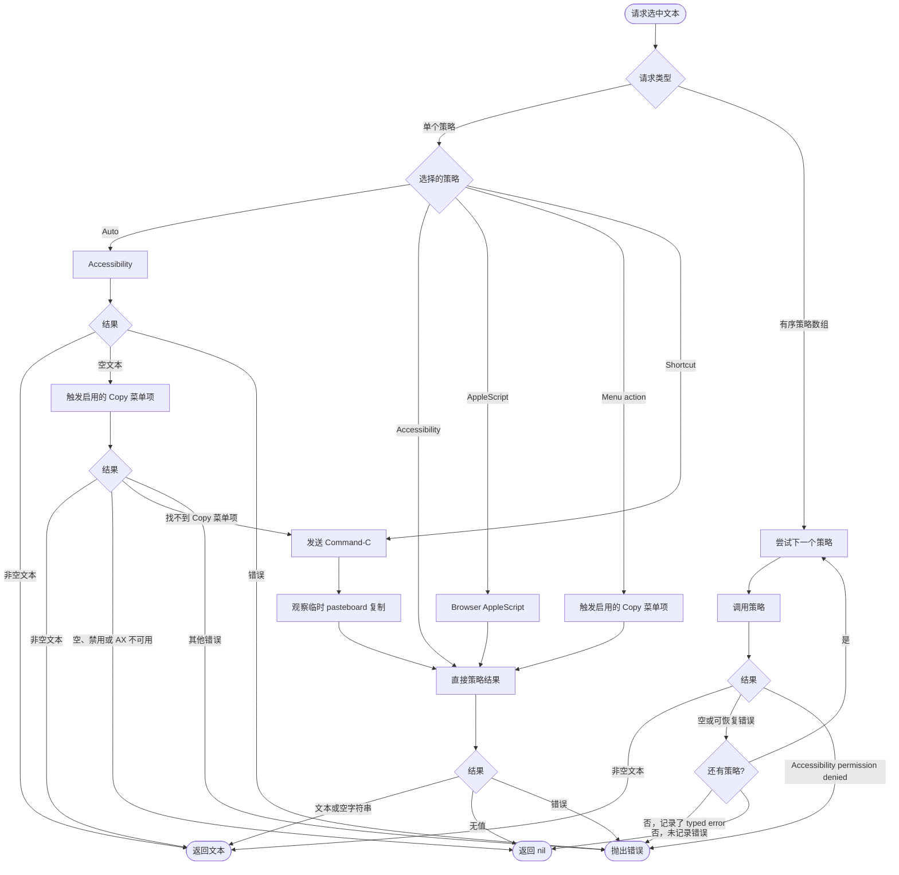

# 选中文本获取流程

```mermaid
flowchart TD
    Start([请求选中文本]) --> RequestType{请求类型}

    RequestType -- 单个策略 --> Strategy{选择的策略}
    RequestType -- 有序策略数组 --> Next[尝试下一个策略]

    Strategy -- Auto --> AutoAX[Accessibility]
    Strategy -- Accessibility --> DirectResult[直接策略结果]
    Strategy -- AppleScript --> AppleScript[Browser AppleScript]
    Strategy -- Menu action --> DirectMenu[触发启用的 Copy 菜单项]
    Strategy -- Shortcut --> Shortcut[发送 Command-C]

    AutoAX --> AXResult{结果}
    AXResult -- 非空文本 --> Success([返回文本])
    AXResult -- 空文本 --> AutoMenu[触发启用的 Copy 菜单项]
    AXResult -- 错误 --> Failure([抛出错误])

    AutoMenu --> MenuText{结果}
    MenuText -- 非空文本 --> Success
    MenuText -- 空、禁用或 AX 不可用 --> Empty([返回 nil])
    MenuText -- 找不到 Copy 菜单项 --> Shortcut
    MenuText -- 其他错误 --> Failure

    Shortcut --> Pasteboard[观察临时 pasteboard 复制]
    DirectMenu --> DirectResult
    AppleScript --> DirectResult
    Pasteboard --> DirectResult
    DirectResult --> StrategyResult{结果}
    StrategyResult -- 文本或空字符串 --> Success
    StrategyResult -- 无值 --> Empty
    StrategyResult -- 错误 --> Failure

    Next --> Attempt[调用策略]
    Attempt --> ArrayResult{结果}
    ArrayResult -- 非空文本 --> Success
    ArrayResult -- 空或可恢复错误 --> More{还有策略?}
    ArrayResult -- Accessibility permission denied --> Failure
    More -- 是 --> Next
    More -- 否，记录了 typed error --> Failure
    More -- 否，未记录错误 --> Empty
```

`.auto` 当前先尝试 Accessibility，再尝试菜单操作。只有找不到 Copy 菜单项时才回退到键盘快捷键；它不会自动调用 AppleScript。需要其他顺序的调用方使用有序策略数组 API。
